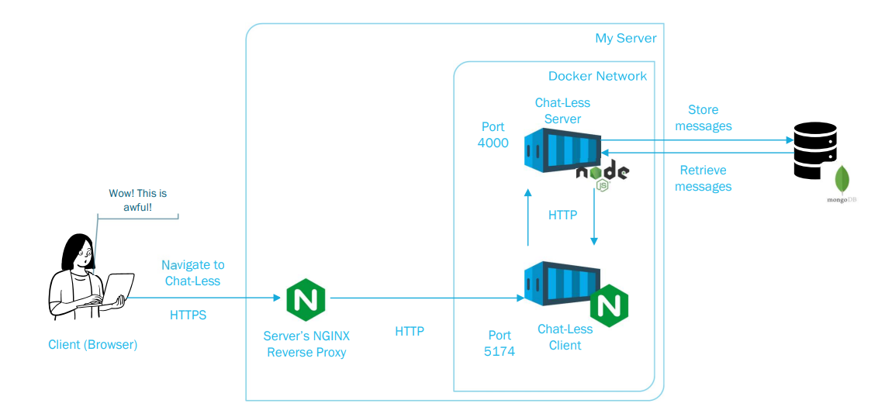
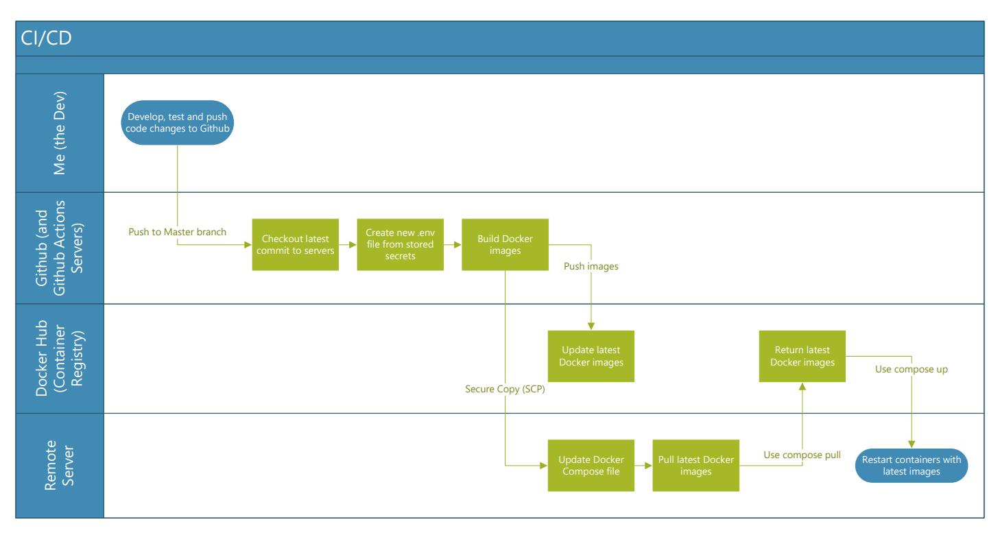

The goal at the beginning of this project was to create a **Continuous Integration/Continuous Deployment** or **CI/CD pipeline**.

In short, it was a success! I can now make changes to the code, test the changes, push the changes to Github and this pipeline handles pushing the changes to the [Chat Less](https://chat.tenkiame.org/) app that I made.

Part of it, however, was thinking I'd need to migrate the app to [Docker](https://www.docker.com/) containers before I could achieve this. This is not true at all, but learning about Docker was also on the list so I was able to kill two birds with one stone. In fact, learning about and migrating to Docker probably took up 90% of the project time. Time well spent. I think.

The **CI** part of the pipeline starts with building the [**Docker Image**](https://www.geeksforgeeks.org/devops/what-is-docker-image/) using a [**Dockerfile**](https://www.geeksforgeeks.org/cloud-computing/what-is-dockerfile/) and the code from the latest commit in the app's repo.

Then the **Docker Image** is pushed to an **image registry**  (an image storage), in this case it's [Dockerhub](https://hub.docker.com/).

The **CD** part of the pipeline is then "remoting in" to my remote server, pulling the **Docker Image** from Dockerhub and restarting the **Docker containers** using said images.

In my swimlane flow diagram, there's mention of **Docker Compose** - this feature of Docker defines and manages behaviour for using multiple containers. It's incorporated since Chat Less is split into a back-end container and front-end container (see the Docker setup diagram).

