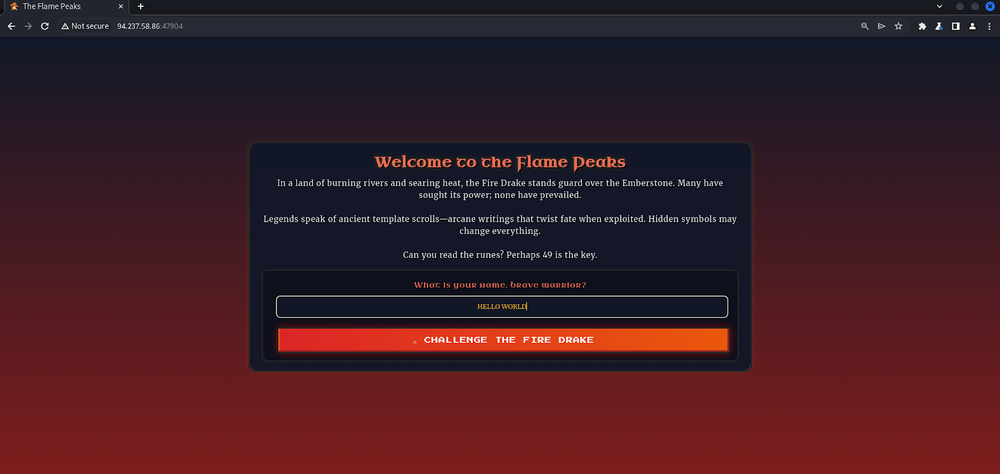
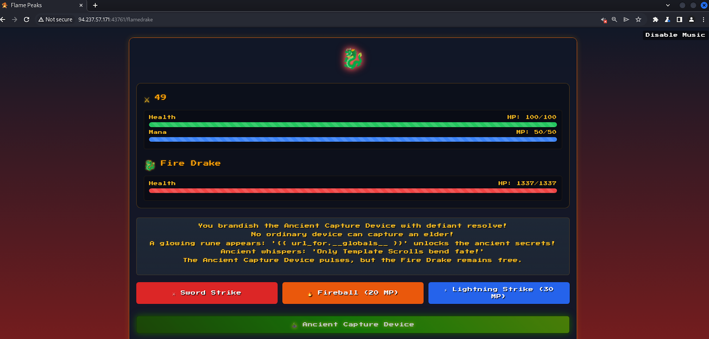
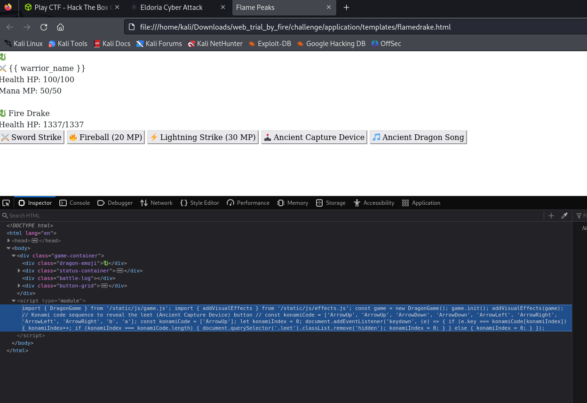
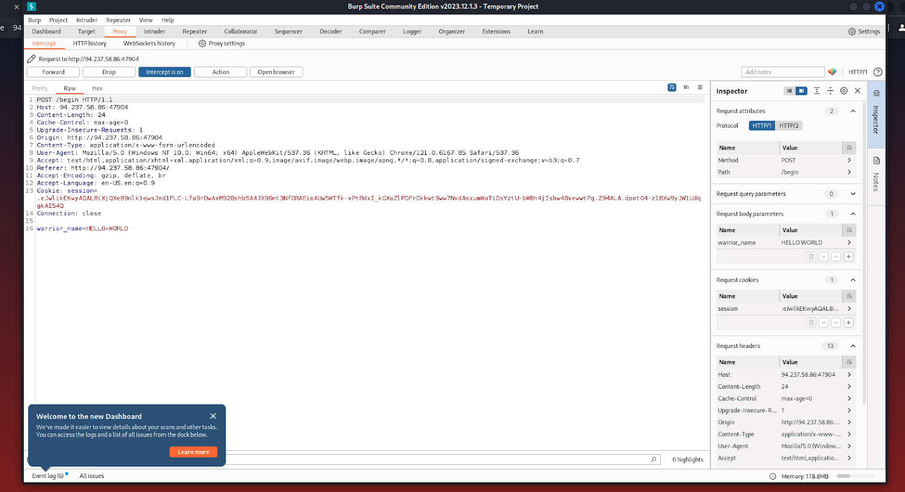
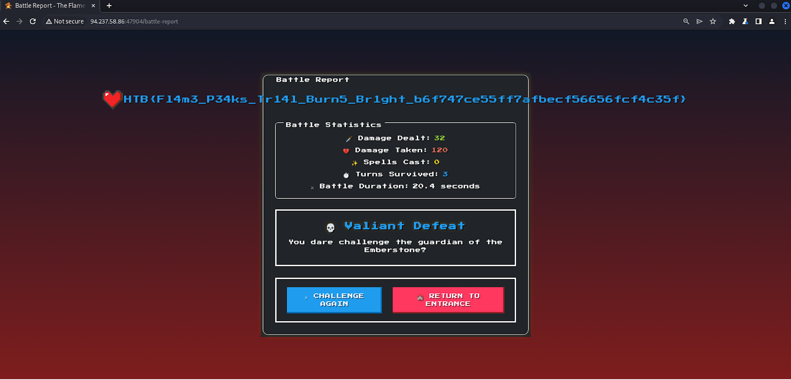

This challenge was basically my now-certified penetration testing specialist friend, [Nathan](https://nathan-ellison.com/)🥳 guiding me through a Server-Side Template Injection. But of course, there's no way of knowing what kind of exploit is required unless the web app is explored first.


When you first open the web app presented, you're hit with a prompt to enter your name and a cryptic clue of `Can you read the runes? Perhaps 49 is the key?`.




After entering your name, you're then brought to a fully functional RPG battle with a fire drake that you can play. It's these sort of challenges that make the HTB CTF challenges fun because you can tell the creators put a lot of effort into these.
The problem with this battle (and the problem you need to solve) is that no matter how you play the battle, you will always lose.





Now, the battle screenshot above features an 'Ancient Capture Device' that at first, seems like the solution to the issue, but is actually another clue. This was found by looking at the rest of source files available, chiefly among them was the `flamedrake.html` file which contains a script that allows players to enter the Konami code and unlock the Ancient Capture Device. I miss when videogames had fun codes like this.



Of course, when using the Ancient Capture Device, you don't win the game but there is clue given that is `'{{ url_for.__globals__ }}`. How the heck is this a clue?
On searching this up, you might find a page or two about doing Python Flask (specifically for Jinja2) server-side template injection, but if you have certified penetration testing specialist with you, they can conveniently direct you to a [Github repo with a cheatsheet for Python SSTI exploits](https://github.com/swisskyrepo/PayloadsAllTheThings/blob/master/Server%20Side%20Template%20Injection/Python.md#exploit-the-ssti-by-calling-ospopenread).


Well where do you even make this injection? At the beginning, there was a clue `Can you read the runes? Perhaps 49 is the key?`. Turns out that using `7 * 7` is a common test for [SSTIs](https://portswigger.net/web-security/server-side-template-injection#plaintext-context). This is what actually clued us into thinking it was a SSTI problem. Another look at the source files gives us more clues on what to exploit:


```
>>> requirements.txt
Flask==3.1.0
gunicorn==23.0.0
supervisor==4.2.5
Jinja2==3.1.5
werkzeug==3.1.3
MarkupSafe==3.0.2
```

```python
//>>> Routes.py 
@web.route('/')
def index():
    return render_template('index.html')


@web.route('/begin', methods=['POST'])
def begin_journey():
    warrior_name = request.form.get('warrior_name', '').strip()
    if not warrior_name:
        return redirect(url_for('web.index'))


    session['warrior_name'] = warrior_name
    return render_template('intro.html', warrior_name=warrior_name)


@web.route('/flamedrake')
def flamedrake():
    warrior_name = session.get('warrior_name')
    if not warrior_name:
        return redirect(url_for('web.index'))
    return render_template("flamedrake.html", warrior_name=warrior_name)


@web.route('/battle-report', methods=['POST'])
def battle_report():
    warrior_name = session.get("warrior_name", "Unknown Warrior")
    battle_duration = request.form.get('battle_duration', "0")
```


From the `begin_journey()` function, we can tell that user input is being passed to a `render_template()` which means that passing in our payload as our warrior name is a viable place to try for injection. At the same time, we can also tell that Jinja2 is the specific Flask template engine that we need to look up exploits for. We do our injection through the use of Burp Suite.




There's a couple of payloads that can be used, but the one I used was `{{ self.__init__.__globals__.__builtins__.__import__('os').popen('id').read() }}`. Of course, this alone won't actually solve our problem since you need to include the Linux command that will get us what we want.
So we modify the `'id'` part with a `'cat <file>'` like this:
`{{ self.init.globals.builtins.import('os').popen('cat /app/application flag.txt').read() }}`.
How do I find the directory and name of the file I wanted? By running the same thing with `ls` and seeing files are available in the default (and subsequent) directories.
After much wrestling with this, you eventually get the flag in the results screen:





Of course, a bit of the process (read: struggling) was omitted so it didn't actually go this smoothly, but it was still quite fun. I also did a [command injection challenge](https://github.com/hackthebox/cyber-apocalypse-2025/tree/main/web/web_whispers_of_the_moonbeam) which was much easier but that's not really worth writing about. There were also some AI prompt injection ones that I failed to do, but maybe one day I'll get my revenge.


