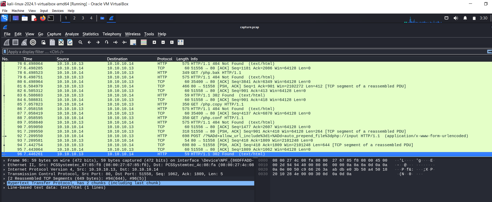
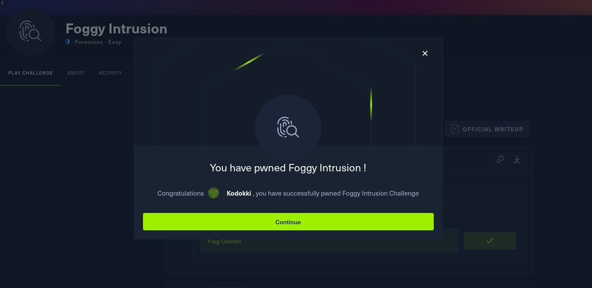

My now former co-worker has finally made his entry in pro cybersecurity world (congrats if you're reading this, Nathan!) and became an organiser for the local Hack the Box meetups. So naturally, I made my first attendance to get some more cybersecurity exposure (and pizza).

The meetup was in two parts - a talk given by a cybersecurity professional, and a guided Hack the Box challenge.

The talk was by a fellow named Zac - titled "Is Windows Defender Enough?".

The answer? Maybe. 

It was a good talk and gave me more paranoia about viruses and the lack of protection that anti-virus programs provide but I don't have the rights to publish the details of the presentation (since he worked so hard to replicate getting past anti-viruses).

The next part was a forensics challenge called `Foggy Intrusion` where, given a *.pcap* file containing logs of some web traffic, figure out what's been exfiltrated from the system.

To make use of this file, we were walked through using a program called `Wireshark` to sift through the traffic logs. (Light spoilers for the machine below.)

Essentially, with the help of the organisers, we would filter through the HTTP requests - with the interesting ones being POST requests. Then, we can have a closer look at the requests by making use of Wireshark's "Follow HTTP Stream" feature and notice that our imaginary attacker put in a PHP script to some decoding. Upon decoding their script, we then find a Powershell script that does a bit of encoding along with the encoded exfilled data. We then apply the proper decodes on the data and voila, we find the flag that we're looking for in the exfiltrated config file.

This was quite fun so I'm hoping to attend more and make greater use of my newly designed banner.